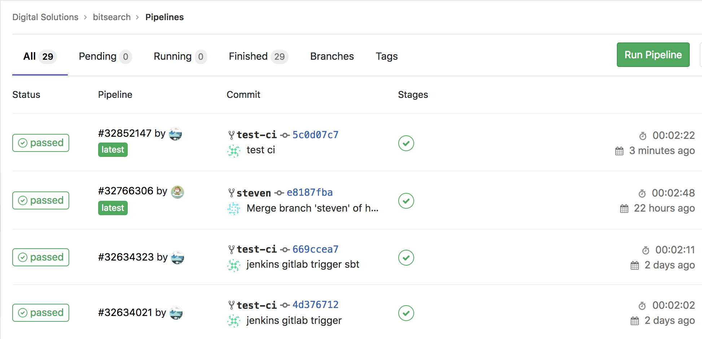
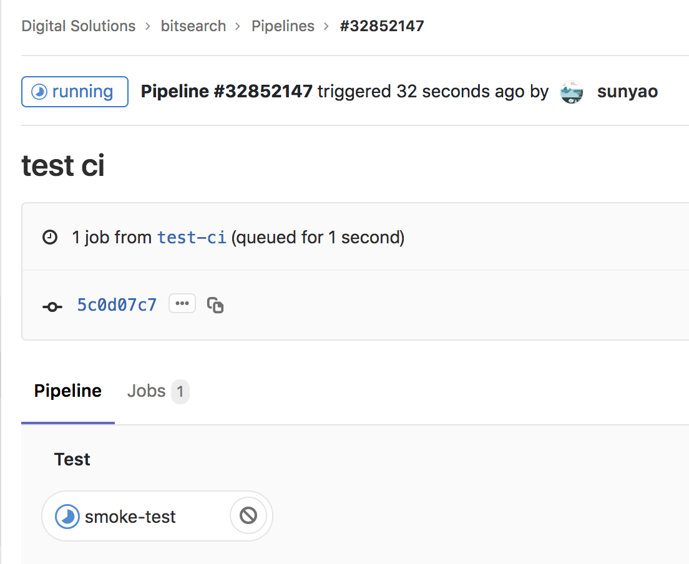
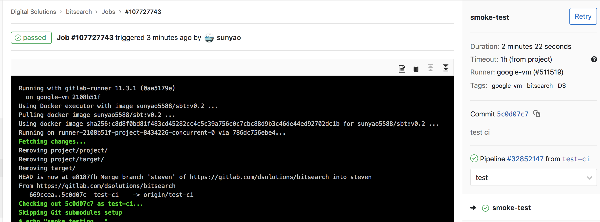
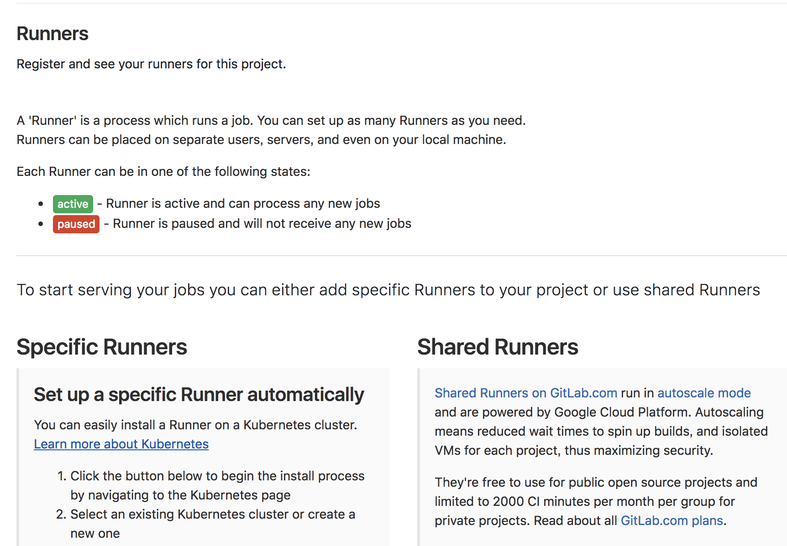
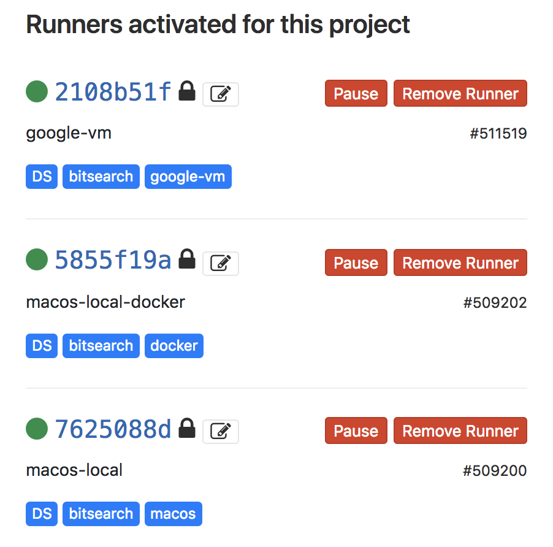
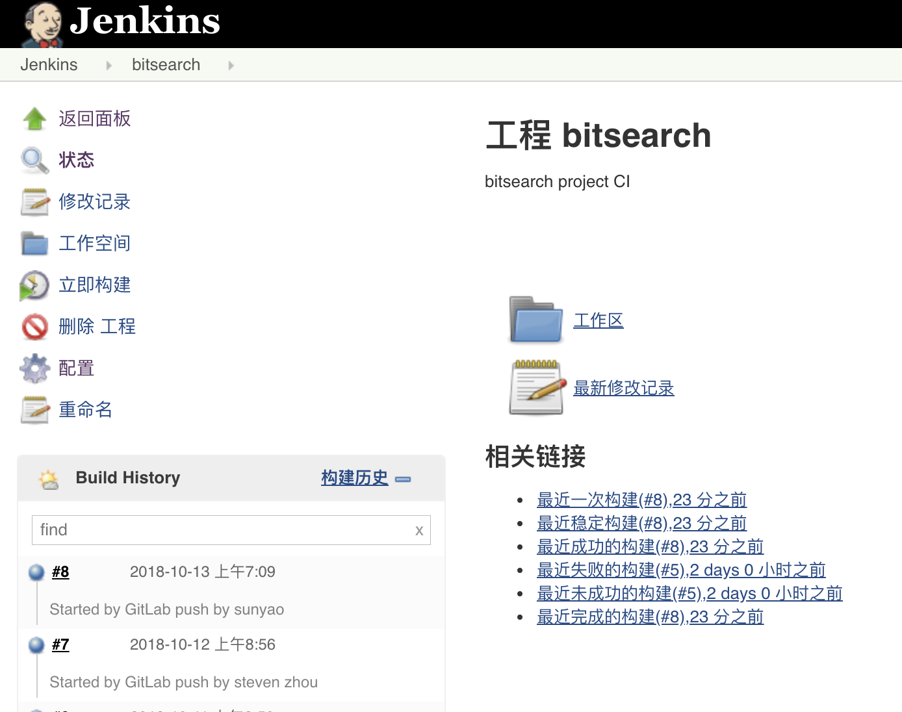

# How to use CI to fasten your project?
## what happened after "git push" ?

> GitLab has integrated CI/CD pipelines to build, test, deploy, and monitor your code.
                
One of the available gitlab-runners will be captured to run CI script(compile/package/test/deploy). These gitlab-runners are placed on separate users, servers, containers and even on your local machine.
Work for different branches:       

CI processing:            

CI passed:         


These are two kinds of gitlab runner. One is Shared Runners which are free to use for public open source projects and limited to 2000 CI minutes per month per group for private project on [gitlab.com](https://gitlab.com) and another one is Specific Runners which are specific for group projects.

Two kinds of gitlab runners:   


Specific Runner for bitsearch project:


.gitlab-ci.yml文件:
```yaml
stages:
  - test

smoke-test:
  stage: test
  image: sunyao5588/sbt:v0.2
  script:
    - echo "stage test smoke testing..."
    - sbt "test:testOnly *JsonModelSpec"
  tags:
    - DS
    - bitsearch
    - google-vm
```


## Runner execurator (docker) 
In bitsearch project we use docker image to set up sbt build environment and use local host directory to store project required liberies in order to save time from downloading libs everytime while building.

## trigger jenkins project
Setup Integrations(webhooks) in gitlab.com (push events).

jenkins project has also be set up to be triggered after "git push" to gitlab repository.    



Conclusion: 
1. After "git push", compile/package/test/deploy are automatically triggered based on .gitlab-ci.yml.
2. Available runners will be used to run CI process.
3. Jenkins project can also be used to run CI script instead of gitlab Runners.

